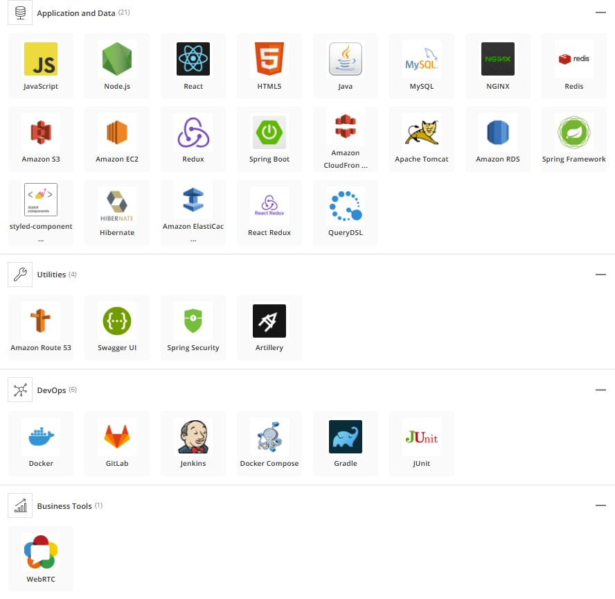
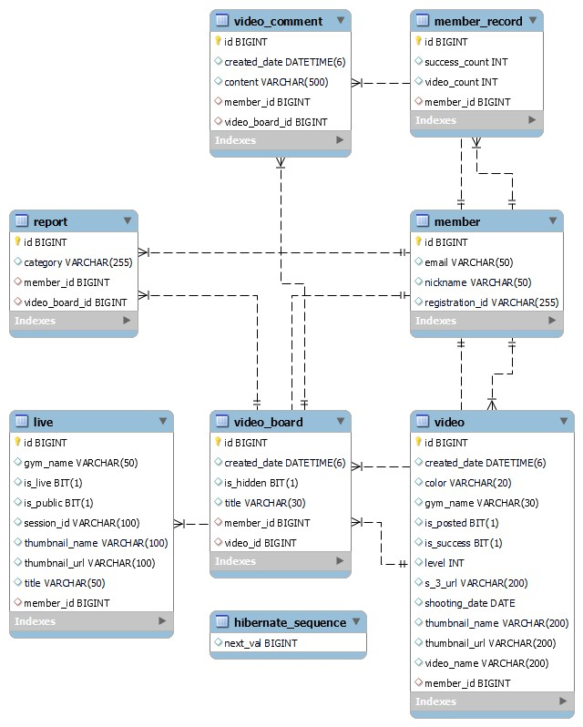
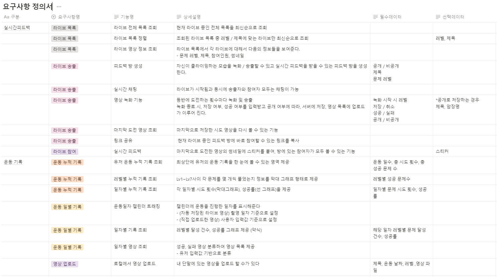
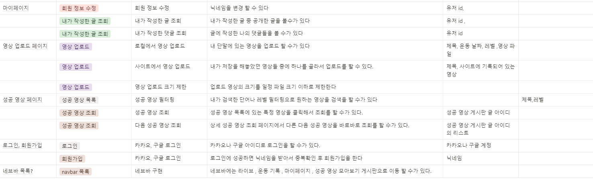

# Color The Rock - 클라이밍 실시간 피드백 서비스

## Color The Rock 링크 : https://colortherock.com

## 프로젝트 진행기간

2023.01.02(월) ~ 2023.02.17(금) 7주간 진행

SSAFY 8기 2학기 공통 프로젝트

## 프로젝트 소개

* 프로젝트명: 클라이밍 실시간 피드백 서비스
* 서비스 특징: 클라이밍 피드백이 필요한 사람들을 위한 실시간, 커뮤니티 피드백 서비스
* 주요 기능
  - 클라이밍 라이브 기능
    - 실시간 화상 라이브로 다른 사람이 클라이밍 하는 것을 볼 수 있어요
    - 실시간 채팅으로 여러  사람들과 소통 할  수 있어요
    - 상대방에게 피드백을 주고 싶다면 화면에 이모지를 찍어 표시 할 수 있어요
    - 자신이 도전한 클라이밍을 녹화해서 저장 할 수 있어요
  - 커뮤니티 기능
    - 다른 사람들이 올려 놓은 성공 영상을 찾아 볼 수 있어요
    - 검색으로 내가 풀 지 못했던 문제들을 검색 할 수 있어요
  - 나의 클라이밍 기록 보기
    - 내가 이전에 도전 했던 클라이밍 영상들을 모아서 볼 수 있어요
    - 레벨 별 도전 현황 , 총 도전 횟수 , 방문했던 암장, 일별 도전 기록 등을 볼 수 있어요
* 주요 기술
  - WebRTC
  - WebSocket
  - JWT Authentication
  - REST API
* 참조 리소스
  * React: 디자인 전반 적용
  * Vue Argon Design System: 디자인 전반 적용
  * Vue Black Dashboard Pro(유료): 캘린더 컴포넌트 사용
  * AR Core: 구글에서 제공하는 AR 지원 라이브러리. 이미지 인식 및 오버레이 영상에 활용
  * Color Thief: 이미지 색상 추출 라이브러리. 커버 사진 색상 추출 및 배경 변경에 활용
  * Animation.css: CSS 애니메이션 지원 라이브러리. 메인 페이지 진입 애니메이션에 활용

## 팀 소개
* 최태규: 팀장, 백엔드 개발 리더, CI/CD , API 개발

* 공조한: 백엔드 개발, API 개발 ,테스트 코드 작성

* 허예지: 백엔드 개발, WebRTC , API 개발 , 테스트 코드 작성

* 김현수: 프론트엔드 개발, WebRTC

* 송현주: 부팀장, 프론트엔드 리더, 와이어 프레임 및 디자인 구성 

  

## 기술 스택

## 협업 도구

- Jira
  - Jira로 프로젝트 스프린트를 정하고 한 주의 계획대로 프로젝트를 진행 했습니다
- Notion
  - Notion에 회의 스크럼, 요구 사항 정의서 , ERD , 등등을 문서화 해서 저장 했습니다
- Mattermost
  - Mattermost를 이용해서 Jenkins 빌드 알람 , 에러 메시지  출력 , git push 알림등을 사용했습니다.
- GitLab
  - Coding convetion을 지켜서 프로젝트를 진행했습니다.

## ERD

## API 명세서

[API 명세서](./docs/swagger.html)

## 요구사항 정의서

## CI / CD 파이프라인

1. GitLab에서 Push나 PR시 Webhook이 감지해서 Jenkins에 요청을 보낸다.
2. 젠킨스에서 요청을 받으면 git을 pull해서 repository를 업데이트 한다.
3. 젠킨스에서 업데이트한 git code를 바탕으로 gradle을 통해서 jar 파일을 빌드한다.
4. Jenkins에서 jar 파일을 기반으로 docker image를 생성해서 docker hub에 푸시한다.
5. Jenkins에서 Spring Woker Server에 SSH 통신을 해서 쉘 스크립트를 실행시킨다.
6. Spring Worker Server에서는 Shell Script를 통해서 Docker Image를 pull한다.
7. 현재 포트가 8081(Green) 포트이거나 켜져 있지 않은경우 8080(Blue)포트에다가 서버를 실행시킨다.
8. 현재 포트가 8080일경우에는 8081번 포트에다가 서버를 실행시킨다.
9. Nginx에서 현재 설정되어 있는 포트를 확인한다.
10. Nginx에서 각 worker서버와 SSH 통신을 해서 현재 설정되어 있는 포트와 반대 포트에 서버가 실행되고 있는지 확인한다.
11. 모든 서버에 반대 포트가 실행 중일때 NGINX에서 설정을 Blue - > Green ( Green -> Blue)로 포트를 스위칭 하고 리로드한다.

## Design

.png)

##  사이트 기능 설명

