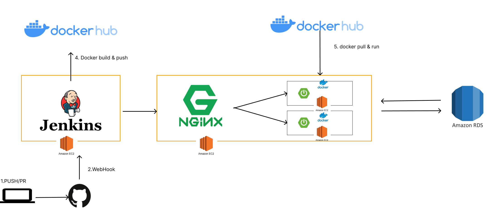

# 웹/모바일(웹 기술) 스켈레톤 프로젝트

<!-- 필수 항목 -->

## 카테고리

| Application | Domain | Language | Framework |
| ---- | ---- | ---- | ---- |
| :white_check_mark: Desktop Web | :black_square_button: AI | :white_check_mark: JavaScript | :black_square_button: Vue.js |
| :black_square_button: Mobile Web | :black_square_button: Big Data | :black_square_button: TypeScript | :white_check_mark: React |
| :white_check_mark: Responsive Web | :black_square_button: Blockchain | :black_square_button: C/C++ | :black_square_button: Angular |
| :black_square_button: Android App | :black_square_button: IoT | :black_square_button: C# | :black_square_button: Node.js |
| :black_square_button: iOS App | :black_square_button: AR/VR/Metaverse | :white_check_mark: Python | :black_square_button: Flask/Django |
| :black_square_button: Desktop App | :black_square_button: Game | :white_check_mark: Java | :white_check_mark: Spring/Springboot |
| | | :black_square_button: Kotlin | |

<!-- 필수 항목 -->

## 프로젝트 소개

* 프로젝트명: 클라이밍 실시간 피드백 서비스
* 서비스 특징: 클라이밍 피드백이 필요한 사람들을 위한 실시간, 커뮤니티 피드백 서비스
* 주요 기능
  - 회원 관리
  - 클라이밍 피드백룸
  - 실시간 채팅
  - 클라이밍 피드백 커뮤니티
* 주요 기술
  - WebRTC
  - WebSocket
  - JWT Authentication
  - REST API
* 참조 리소스
  * React: 디자인 전반 적용
  * Vue Argon Design System: 디자인 전반 적용
  * Vue Black Dashboard Pro(유료): 캘린더 컴포넌트 사용
  * AR Core: 구글에서 제공하는 AR 지원 라이브러리. 이미지 인식 및 오버레이 영상에 활용
  * Color Thief: 이미지 색상 추출 라이브러리. 커버 사진 색상 추출 및 배경 변경에 활용
  * Animation.css: CSS 애니메이션 지원 라이브러리. 메인 페이지 진입 애니메이션에 활용
* 배포 환경
  - URL: // 웹 서비스, 랜딩 페이지, 프로젝트 소개 등의 배포 URL 기입
  - 테스트 계정: // 로그인이 필요한 경우, 사용 가능한 테스트 계정(ID/PW) 기입

<!-- 자유 양식 -->

## 팀 소개
* 최태규: 팀장, 백엔드 개발 리더, CI/CD
* 공조한: 백엔드 개발, WebSocket
* 김현수: 프론트엔드 개발, WebRTC
* 송현주: 부팀장, 프론트엔드 리더, 와이어 프레임 및 디자인 구성 
* 허예지: 백엔드 개발, WebRTC

<!-- 자유 양식 -->

## 요구사항 정의서

## 프로젝트 상세 설명

// 개발 환경, 기술 스택, 시스템 구성도, ERD, 기능 상세 설명 등

### 기술 스택

* Front-end

React, Redux Saga, Styled Components

* Back-end

Spring Boot, JDK 11, JPA, mysql

## CI / CD 파이프라인

1. GitLab에서 Push나 PR시 Webhook이 감지해서 Jenkins에 요청을 보낸다.
2. 젠킨스에서 요청을 받으면 git을 pull해서 repository를 업데이트 한다.
3. 젠킨스에서 업데이트한 git code를 바탕으로 gradle을 통해서 jar 파일을 빌드한다.
4. Jenkins에서 jar 파일을 기반으로 docker image를 생성해서 docker hub에 푸시한다.
5. Jenkins에서 Spring Woker Server에 SSH 통신을 해서 쉘 스크립트를 실행시킨다.
6. Spring Worker Server에서는 Shell Script를 통해서 Docker Image를 pull한다.
7. 현재 포트가 8081(Green) 포트이거나 켜져 있지 않은경우 8080(Blue)포트에다가 서버를 실행시킨다.
8. 현재 포트가 8080일경우에는 8081번 포트에다가 서버를 실행시킨다.
9. Nginx에서 현재 설정되어 있는 포트를 확인한다.
10. Nginx에서 각 worker서버와 SSH 통신을 해서 현재 설정되어 있는 포트와 반대 포트에 서버가 실행되고 있는지 확인한다.
11. 모든 서버에 반대 포트가 실행 중일때 NGINX에서 설정을 Blue - > Green ( Green -> Blue)로 포트를 스위칭 하고 리로드한다.
